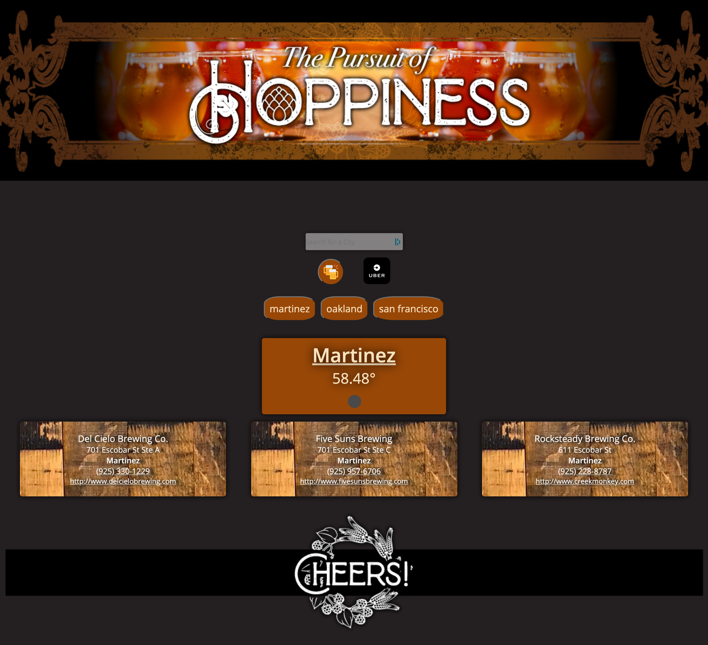

# group-project1

Discription:
Created a local brewery locator application that allows the user to search for any city and retrieve the forcasted temerature, for the location as well as a list of all Breweries in the area.

 

boiler plate added 
variables created in javascript 
added script source in html for javascript 
created flexbox for campsites 
added api from yelp in js 
added api and key for weather forcast 

 

- Git Repo - https://github.com/ 
- Direct link - https://  

